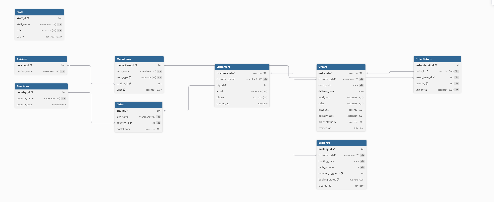

# Little Lemon Restaurant Database System

## Abstract

This project implements a comprehensive relational database management system for Little Lemon Restaurant using Microsoft SQL Server. The system is designed to manage customer data, orders, menu items, and table bookings with proper normalization up to Third Normal Form (3NF).

## Project Structure

```
├── littlelemon_database.sql          # Database schema and sample data
├── littlelemon_stored_procedures.sql # Booking management procedures
├── littlelemon.dbml                  # Entity-Relationship diagram (DBML format)
├── FINAL_LEMON.png                   # ER Diagram visualization
└── LittleLemon_data.xlsx             # Source data (21,000 records)
```

## Database Schema

### Entity-Relationship Diagram



### Tables Overview

| Table          | Description                    | Primary Key       |
| -------------- | ------------------------------ | ----------------- |
| `Cuisines`     | Cuisine type classifications   | `cuisine_id`      |
| `Countries`    | Geographic country reference   | `country_id`      |
| `Cities`       | City locations with country FK | `city_id`         |
| `MenuItems`    | Restaurant menu with pricing   | `menu_item_id`    |
| `Customers`    | Customer profiles              | `customer_id`     |
| `Orders`       | Order header information       | `order_id`        |
| `OrderDetails` | Order line items               | `order_detail_id` |
| `Bookings`     | Table reservation records      | `booking_id`      |
| `Staff`        | Employee information           | `staff_id`        |

## Stored Procedures

The following stored procedures are implemented for booking management:

### 1. GetMaxQuantity

Returns the maximum quantity value from all order details.

```sql
EXEC GetMaxQuantity;
```

### 2. ManageBooking

Validates table availability for a specific date.

```sql
EXEC ManageBooking
    @booking_date = '2024-01-15',
    @table_number = 5;
```

### 3. AddBooking

Creates a new table reservation with validation.

```sql
EXEC AddBooking
    @customer_id = '72-055-7985',
    @booking_date = '2024-02-20',
    @table_number = 10,
    @number_of_guests = 4;
```

### 4. UpdateBooking

Modifies existing booking details with conflict detection.

```sql
EXEC UpdateBooking
    @booking_id = 1,
    @new_booking_date = '2024-02-25',
    @new_table_number = 8;
```

### 5. CancelBooking

Sets booking status to cancelled.

```sql
EXEC CancelBooking @booking_id = 2;
```

## Technical Specifications

- **Database Engine**: Microsoft SQL Server
- **Normalization**: Third Normal Form (3NF)
- **Data Integrity**: Foreign key constraints with referential actions
- **Performance**: Indexed columns on frequently queried fields

## Installation

1. Execute `littlelemon_database.sql` to create the database schema
2. Execute `littlelemon_stored_procedures.sql` to create stored procedures
3. Verify installation by running the test cases included in the procedures file

## Data Model Characteristics

- Normalized structure eliminates data redundancy
- Referential integrity maintained through foreign key constraints
- Check constraints ensure data validity (e.g., booking status values)
- Computed columns reduce application-layer calculations

## License

This project is developed for educational purposes as part of the Meta Database Engineer Professional Certificate on Coursera.
